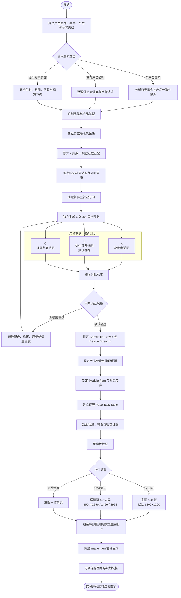

# 电商全案助手

一个面向 Codex / ChatGPT 的电商视觉策划与出图技能。它从买家需求出发，完成产品分析、购买决策判断、风格确认、页面模块规划、主图与详情页生成，以及分类交付。

适用于淘宝、天猫、京东、拼多多、抖音电商和小红书等场景。平台会影响内容重点、文案密度与视觉策略，但不会自动改变本技能的默认生产尺寸。

> 核心执行规则以 [`SKILL.md`](e-commerce-full-service-assistant/SKILL.md) 为准；README 用于快速了解、安装和使用。

## 核心能力

- 从产品图片提取可确认事实、产品一致性锚点和待确认信息。
- 根据品类和购买决策类型建立买家需求优先级。
- 将买家问题、产品卖点和视觉证据逐一匹配。
- 在完整页面规划前先进行三方向风格确认。
- 规划 5–8 张主图和 8–14 屏详情页，并控制整套视觉节奏。
- 锁定产品结构、颜色、材质、比例、配件位置和物理空间关系。
- 使用内置 `image_gen` 直接生成最终图片，不以提示词文档代替成品。
- 按风格确认、主图、详情页和规划文档分类保存。

## 完整工作流程



## 风格确认：三张独立预览 + 横向总览

风格确认是正式批量出图前唯一默认暂停、等待用户决策的节点。

三个方向必须保持公平的比较条件：

- 使用同一产品和同一套产品一致性锚点。
- 使用相同或接近的产品角度、比例和信息量。
- 使用同一个买家需求、核心卖点和短文案。
- 每张独立预览均为 `1200×1600px`、3:4 竖版。
- 只改变配色、背景、光影、字体感、构图语言、装饰语言和场景氛围。

推荐保留三张独立原图，并额外提供横向对比总览：

```text
┌────────────────┬────────────────┬────────────────┐
│ A 高参考适配    │ B 优化参考适配  │ C 延展参考适配  │
│                │    默认推荐     │                │
│   3:4 预览图    │   3:4 预览图    │   3:4 预览图    │
└────────────────┴────────────────┴────────────────┘
          选择 A / B / C，或组合不同方向的特征
```

横向总览只用于快速评审，不能替代三张独立原图，也不属于最终主图或详情页。这样既能在同一视线内比较三个方案，又能保留放大查看、单独修改和后续风格锁定所需的完整素材。

用户可以：

- 直接选择 A、B 或 C。
- 选择一个方向并提出调整。
- 组合两个方向的指定特征，例如“B 的配色 + C 的构图”。
- 否决全部方案并要求生成三个新方向。

## 默认生产规格

| 类型 | 默认数量 | 默认尺寸 | 用途 |
|---|---:|---|---|
| 风格预览 | 3 张 | 1200×1600px，3:4 | 正式规划前确认视觉方向 |
| 主图 | 5–8 张 | 1200×1200px，1:1 | 产品全貌、角度、细节、场景、尺寸与包装 |
| 标准产品详情页 | 8–10 屏 | 宽 1504px，高 2256 / 2496 / 2992px | 回答主要购买问题 |
| 复杂产品详情页 | 10–14 屏 | 宽 1504px，高 2256 / 2496 / 2992px | 承载更多独立需求和证据 |

用户明确指定的数量、尺寸、比例、平台、语言和模块顺序优先于默认值。

## 交付目录

```text
<产品名>_电商全案_<YYYYMMDD>/
├── 00_风格确认/
│   ├── style-A.png
│   ├── style-B.png
│   ├── style-C.png
│   ├── style-comparison-wide.png
│   ├── 参考图风格分析.md
│   └── 最终风格确认.md
├── 01_主图/
│   ├── main-01.png
│   └── ...
├── 02_详情页/
│   ├── detail-01.png
│   └── ...
└── 03_规划文档/
    ├── 策略规划.md
    ├── 完整Prompt.md
    └── 交付检查记录.md
```

默认不创建 ZIP；只有用户明确要求时才打包。

## 使用方式

安装技能后，可以直接描述任务，例如：

```text
请为这款产品制作淘宝电商全案，包括 6 张主图和 8 屏详情页。
先分析产品和买家需求，再给我 A/B/C 三种风格预览并横向对比，等我确认后继续出图。
```

建议同时提供：

- 多角度产品图和细节图。
- 产品名称、材质、规格、功能与可确认卖点。
- 目标平台、目标人群和价格定位。
- 喜欢的参考页面或视觉方向。
- 禁止出现的文案、场景或表达。

只有图片也可以启动流程。无法从图片确认的参数、功效、认证、销量、评价和测试数据不会被擅自写成事实。

## 关键原则

- 买家需求优先，不把详情页做成卖点堆砌。
- 一个页面解决一个核心问题，并提供匹配的视觉证据。
- 产品身份和物理逻辑优先于创意变化。
- 参考图只指导风格，不复制品牌、产品、文案或独占性版式。
- 最终主图和详情页必须由内置 `image_gen` 直接生成。
- 不通过本地拼接、贴字、换背景或合成制作最终商品图片。
- 生成完成后不自动进入无限重做；潜在问题作为可选复查项交付。

## 仓库结构

```text
e-commerce-full-service-assistant/
├── SKILL.md
├── agents/openai.yaml
├── assets/icon.svg
└── references/
    ├── buyer-demand-strategy.md
    ├── style-confirmation.md
    ├── page-planning-strategy.md
    ├── page-task-table.md
    ├── product-consistency-physics.md
    ├── generation-tools.md
    └── ...
```

## License

仓库当前未包含许可证文件。未经明确许可，请勿假设获得了超出著作权法默认范围的授权。
